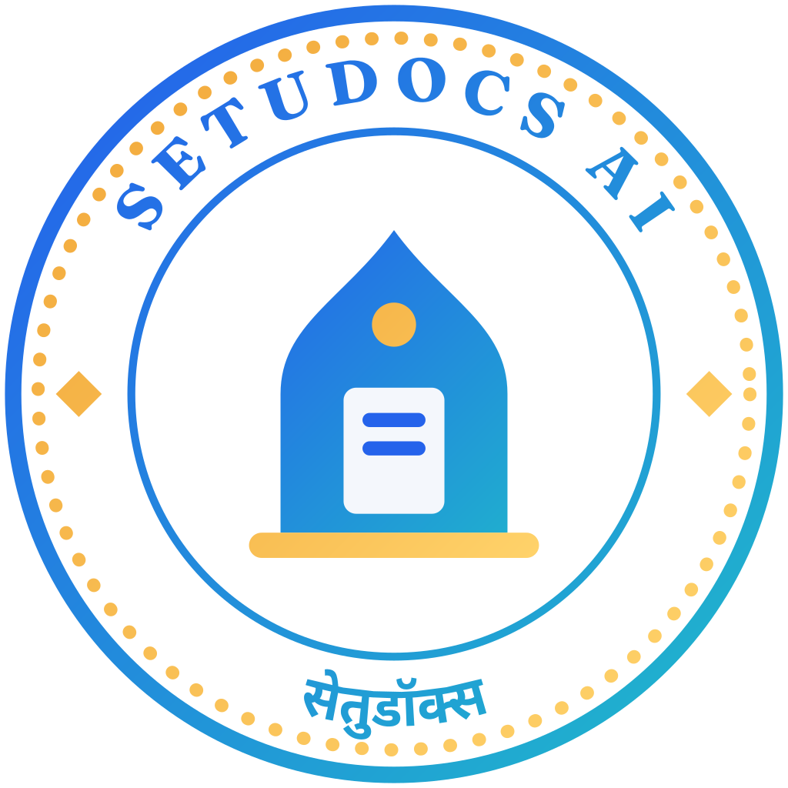
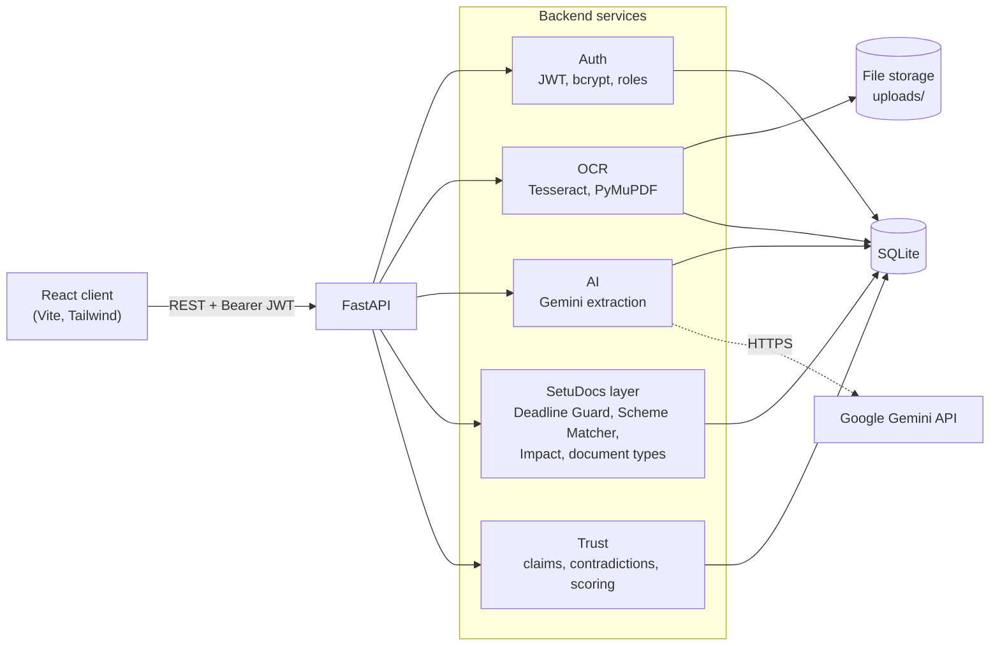

<p align="center">
  
</p>

<h1 align="center">SetuDocs AI</h1>
<p align="center"><strong>Transforming Documents into Actionable Insights.</strong></p>

SetuDocs AI turns scanned and photographed paperwork, in Marathi or English, into a searchable record that warns you before deadlines and shows the government schemes you qualify for. It was built for **Pragyan 2K26** (Track 4: Entrepreneurship & Future of Management) at **Sanjivani University, Kopargaon**, on top of our earlier project, **GovDocs AI**.

**In short**
- **What it does:** reads a scan or photo (Marathi or English), fills in the details with AI, and keeps it searchable.
- **What it adds:** deadline warnings, a scheme matcher with document readiness, and a trust check on each document.
- **How to try it:** a FastAPI backend and a React frontend, started with the commands in [Getting started](#getting-started).

## Contents

- [Documentation](#documentation)
- [The problem](#the-problem)
- [Features](#features)
- [Architecture](#architecture) · [Tech stack](#tech-stack) · [Roles and permissions](#roles-and-permissions)
- [Getting started](#getting-started) · [Demo](#demo) · [Testing](#testing)
- [Project structure](#project-structure)
- [Limitations](#limitations) · [Roadmap](#roadmap-not-built-yet)
- [Team](#team) · [Acknowledgements](#acknowledgements) · [License](#license)

## Documentation

- [Technical documentation (PDF)](docs/SetuDocs_AI_Technical_Documentation.pdf): the full technical write-up
- [Demo guide](docs/DEMO.md): accounts, the 8-step flow, resets, what not to claim
- [Marathi UI strings](docs/MARATHI-STRINGS.md): every English and Marathi string, for review
- [Rebrand changes](docs/REBRAND-CHANGES.md): what changed from GovDocs AI to SetuDocs AI
- [Screenshots](docs/screenshots/): light and dark, desktop and phone

---

## The problem

Small shop owners, farmers and the CAs and CSC operators who serve them keep their important paperwork (licences, registrations, land records, insurance, receipts) as paper, phone photos and WhatsApp forwards. Finding one document takes time, a missed renewal date means a lapsed licence or a penalty, and people rarely know which government schemes they already have the documents for. Much of this paperwork is in Marathi, which most document tools handle poorly.

## Features

### Capture & understand
- **Secure upload.** PDF, JPG and PNG only; a size limit (10 MB by default); the file's leading bytes ("file signature") must match its extension; files are stored under server-generated random names, never the uploaded name.
- **Document check.** Before anything is stored, a fast check rejects uploads that clearly are not documents (selfies, landscapes, screenshots). If the check itself errors, the upload is let through.
- **Tesseract OCR** in English and Marathi (`eng+mar`), including multi-page PDFs.
- **Gemini extraction.** Google Gemini returns a title, summary, department, category, keywords, a confidence score and the dates after which something lapses or must be done. Title and summary can be written in English or Marathi; department, category and keywords always stay English so filtering does not fragment.
- **Smart Search** across nine fields (title, description, original filename, OCR text, AI title, AI summary, AI category, AI department, AI keywords), with filters, sorting, and a typo-tolerant fuzzy fallback when an exact search finds nothing.

### Trust & control
- **Review Queue.** Admins and Officers approve, reject or send back a document with remarks; Admins can archive reviewed documents.
- **Trust & Verification.** Each document gets a trust score (0-100) in a band (High, Moderate, Low, Very Low) and a classification: **Verified**, **Corroborated**, **Needs review**, **Flagged**, or **Outdated** (a document marked as superseded). The page lists the claims found in the document, any contradictions with other documents in the workspace, and the reasons behind the result. A human reviewer can override the machine and every decision is recorded. Evidence comes only from documents already in your workspace; nothing is looked up on the web.
- **Audit log** of logins, uploads, OCR/AI runs, reviews, downloads, deletions and settings changes (Admin only).
- **Roles:** Admin, Officer, Citizen (shown in the app as admin, CA/CSC operator, and individual / business owner).
- **Citizen portal.** Citizens get their own dashboard, upload page and "My Documents", and a Citizen ID (CIT-000001, CIT-000002, ...; shown as "Member ID").

### Act on it
- **Deadline Guard.** Finds expiry, renewal and due dates in the text (English and Marathi, including Devanagari digits and month names) and in Gemini's output, and sorts them into **overdue**, **critical** (0-7 days), **soon** (8-30 days) and **upcoming**. You can also add, edit, complete or dismiss deadlines by hand.
- **Scheme Matcher.** Matches an optional business profile and your uploaded documents against eight central-government schemes and registrations (Udyam Registration, PMEGP, PM MUDRA Yojana, Stand-Up India, CGTMSE, PM SVANidhi, PM Vishwakarma, PM-KISAN). Each match is **likely** or **possible**, with a readiness percentage, the documents you have, the documents still missing, and why it matched. Blank profile answers downgrade a match to "possible" rather than being guessed.
- **Impact.** Counts of digitised documents, deadlines at risk and pipeline time, measured from your own records. "Minutes saved" is labelled **Estimate** and uses stated default assumptions until you have run at least three stopwatch trials for each method (manual vs. SetuDocs).
- **Marathi and English interface**, switchable at any time from the top bar.

### Also included
- **Analytics** dashboard for Admins (uploads over time, approval ratio, department and category breakdowns).
- **PDF export** of a short document summary (about one to two pages).
- **Settings** (Admin): shows the configured OCR engine, Gemini model and upload limits (read-only, set in `.env`) and lets you tune the AI-confidence warning threshold.
- **Recovery Center** (Admin): a disaster-recovery **simulation**. It takes verified snapshots, simulates an outage that suspends writes, and replays queued operations. It does not touch or damage the real database.
- Light and dark mode, document preview, AI-metadata JSON export.

---

## Architecture



An upload is validated and stored, then OCR runs in the background, then Gemini extraction, then the deadline, document-type and trust steps. Routers stay thin; the logic lives in `backend/app/services/`.

## Tech stack

| Layer | Technology | Version |
|---|---|---|
| Frontend | React | ^18.3.1 |
| | Vite | ^6.0.5 |
| | Tailwind CSS | ^3.4.17 |
| | Axios | ^1.7.9 |
| | Recharts | ^2.15.4 |
| | lucide-react | ^0.469.0 |
| Backend | FastAPI | 0.115.6 |
| | Uvicorn | 0.32.1 |
| | SQLAlchemy | 2.0.36 |
| | Pydantic / pydantic-settings | 2.12.5 / 2.14.2 |
| Database | SQLite | bundled with Python |
| Auth | python-jose (JWT), passlib + bcrypt | 3.3.0, 1.7.4 + 4.0.1 |
| OCR | Tesseract (separate install), pytesseract, PyMuPDF, Pillow | pytesseract 0.3.13, PyMuPDF 1.28.0, Pillow 12.3.0 |
| AI | Google Gen AI SDK (`google-genai`) | 2.16.0 |
| Search / export | RapidFuzz, fpdf2 | 3.14.5, 2.8.2 |
| Tests | pytest | see `backend/requirements-dev.txt` |

## Roles and permissions

| Capability | Admin | Officer | Citizen |
|---|:-:|:-:|:-:|
| Upload documents | ✔ | ✔ | ✔ |
| See documents | all | all | own only |
| Smart Search, Documents list | ✔ | ✔ | - |
| Edit metadata, re-run OCR / AI, delete documents | ✔ | ✔ | - |
| Review Queue (approve / reject / send back) | ✔ | ✔ | - |
| Trust & Verification: view, run analysis, decide | ✔ | ✔ | view own |
| Send own document for trust review | ✔ | ✔ | ✔ |
| Archive reviewed documents | ✔ | - | - |
| Deadline Guard, Impact | ✔ (whole workspace) | ✔ (whole workspace) | ✔ (own only) |
| Scheme Matcher (uses the signed-in user's own profile and uploads) | ✔ | ✔ | ✔ |
| Download a document / summary PDF | ✔ | ✔ | own only |
| Analytics, Audit Logs, Settings, Recovery Center | ✔ | - | - |
| Self-service sign-up | - | - | ✔ (sign-up only ever creates Citizens) |

---

## Getting started

### Prerequisites
- **Python 3.11 or newer** (developed and tested on 3.13)
- **Node.js 18 or newer** (tested on 24) with npm
- **Tesseract OCR** with the `eng` and `mar` language files
  - Windows: install Tesseract (for example the UB Mannheim build), which includes `eng`. Download `mar.traineddata` from the [tessdata_fast](https://github.com/tesseract-ocr/tessdata_fast) repository and put it in Tesseract's `tessdata` folder. If that folder is not writable, keep your own `tessdata` folder and point `TESSDATA_PREFIX` at it. If `tesseract` is not on your `PATH`, set `TESSERACT_CMD`.
  - macOS / Linux: install Tesseract and its Marathi language pack with your package manager (not tested by us).
  - No `mar.traineddata` yet? Set `OCR_LANGUAGE=eng`. With `eng+mar` and no Marathi file, OCR does not fail: Tesseract quietly reads English only, so Marathi text is silently not read.
- A **Gemini API key** from [Google AI Studio](https://aistudio.google.com/apikey). Without one the app still runs, and AI extraction reports "not configured".

### Backend
```powershell
cd backend
python -m venv .venv
.venv\Scripts\activate            # macOS / Linux: source .venv/bin/activate
pip install -r requirements.txt
copy .env.example .env            # macOS / Linux: cp .env.example .env
# edit .env: set GEMINI_API_KEY, and TESSERACT_CMD / TESSDATA_PREFIX if needed
python -m uvicorn app.main:app --reload --port 8080
```
Use port **8080**: the frontend calls `http://127.0.0.1:8080/api`. The database file and demo accounts are created on first start. API docs: http://127.0.0.1:8080/docs, health check: http://127.0.0.1:8080/api/health.

### Frontend
```powershell
cd frontend
npm install
npm run dev
```
Open http://localhost:5173 (the dev server is fixed to that port, which must match `FRONTEND_ORIGIN`). For a production build: `npm run build`.

### Environment variables
All backend settings live in `backend/.env`; [backend/.env.example](backend/.env.example) lists every one with a comment.

| Variable | Purpose | Default |
|---|---|---|
| `APP_NAME`, `ENV` | App name; `development` or `production` | `SetuDocs AI`, `development` |
| `DATABASE_URL` | SQLite location | `sqlite:///./govdocs.db` |
| `FRONTEND_ORIGIN` | Allowed CORS origin | `http://localhost:5173` |
| `JWT_SECRET_KEY`, `JWT_ALGORITHM`, `ACCESS_TOKEN_EXPIRE_MINUTES` | Login tokens | dev secret, `HS256`, `30` |
| `DEMO_ADMIN_PASSWORD`, `DEMO_OFFICER_PASSWORD`, `DEMO_CITIZEN_PASSWORD` | Passwords of the seeded demo accounts | documented in `.env.example` |
| `UPLOAD_DIR`, `MAX_UPLOAD_SIZE_MB` | Upload folder and size limit | `uploads`, `10` |
| `OCR_ENGINE`, `OCR_LANGUAGE` | OCR engine and Tesseract languages | `tesseract`, `eng+mar` |
| `TESSERACT_CMD`, `TESSDATA_PREFIX` | Tesseract paths, only if non-default | unset |
| `GEMINI_API_KEY`, `GEMINI_MODEL`, `AI_OUTPUT_LANGUAGE` | Gemini key, model, default language of AI title/summary | empty, `gemini-3.5-flash-lite`, `english` |

> **Production:** with `ENV=production` the backend refuses to start while `JWT_SECRET_KEY` or any `DEMO_*_PASSWORD` still has its public default. `.env` is git-ignored; never commit it.

### Running the tests
```powershell
cd backend
pip install -r requirements-dev.txt
python -m pytest -q tests
```
The tests use throwaway SQLite files and mocked Gemini calls, so they need neither a key nor Tesseract.

---

## Demo

**Demo accounts.** On first start the backend creates `admin` (Admin), `officer` (Officer) and `citizen_demo` (Citizen, ID CIT-000001). Their passwords are the `DEMO_ADMIN_PASSWORD`, `DEMO_OFFICER_PASSWORD` and `DEMO_CITIZEN_PASSWORD` values in `backend/.env`; the defaults are listed in [backend/.env.example](backend/.env.example). Existing accounts are never overwritten, so changing the variables later does not change an account that already exists.

**Sample data and resets.**
- *Trust & Verification scenario:* sign in as Admin, open **Trust & Verification** and use the demo buttons to seed or remove a set of six sample PM-KISAN documents (an official circular, a forwarded WhatsApp message, an older circular, and so on).
- *Recovery Center:* sign in as Admin; its **Reset** button clears the blackout simulation.
- *Start completely fresh:* stop the backend, delete `backend/govdocs.db`, `backend/recovery/` and the files in `backend/uploads/` (keep `.gitkeep`), then start it again.

**The 8-step demo flow**
1. Sign in as `citizen_demo` (or create an account on the sign-up page).
2. Switch the interface between English and **मराठी** with the language toggle.
3. Upload a scan or photo, for example a shop licence. The document check runs first, then OCR and Gemini extraction.
4. Open the document: read the extracted text and the AI-filled title, summary, category, keywords and confidence.
5. Open **Deadline Guard**: the dates found in the document appear as overdue, critical, soon or upcoming.
6. Open **Scheme Matcher**: fill in the business profile and see likely and possible schemes, readiness and missing documents.
7. Open **Impact**: see the measured counts and the time-saved figure labelled *Estimate*; add stopwatch trials to replace the assumptions.
8. Sign in as `admin`: approve the upload in the **Review Queue**, open **Trust & Verification**, try **Smart Search** (including a misspelled word), and show the **Recovery Center** simulation.

More detail in [docs/DEMO.md](docs/DEMO.md).

## Testing

At the time of writing, `python -m pytest -q tests` reports **84 passed**. Backend tests:

| Suite | Tests | Covers |
|---|---:|---|
| `test_search_service.py` | 24 | Tokenised search across fields, filters, sorting, fuzzy fallback |
| `test_ai_service.py` | 12 | Gemini response parsing, retries, quota and key errors, API-key redaction (Gemini mocked) |
| `test_setu.py` | 48 | Document-type detection, English/Marathi date extraction, deadline sync and API, Scheme Matcher rules, Impact figures, upload-to-deadline pipeline, trust assessment after the AI step |

Not covered by the pytest suites: authentication and role checks, upload validation, the Trust & Verification engine, the Recovery Center and the frontend. The first three, plus the other role-based endpoints, are exercised end to end by `backend/scripts/demo_check.py` (an API smoke test run against a running backend, see [docs/DEMO.md](docs/DEMO.md)). The frontend is verified only by `npm run build` and manual walkthroughs.

## Project structure

```text
SetuDocsAI/
├── backend/
│   ├── app/              FastAPI app: routers, services, models, schemas, data/schemes.json
│   ├── tests/            pytest suites
│   ├── scripts/          seed_demo.py, demo_check.py (demo data and API smoke test), Marathi OCR test
│   ├── .env.example      every backend setting, documented
│   ├── requirements.txt
│   └── requirements-dev.txt
├── frontend/
│   ├── src/              React app: components, pages, i18n (en / mr), api clients
│   ├── public/           static files, including brand/ logo kit
│   └── package.json
├── docs/
│   ├── SetuDocs_AI_Technical_Documentation.pdf
│   ├── DEMO.md           demo guide
│   ├── MARATHI-STRINGS.md  Marathi UI strings, for review
│   ├── REBRAND-CHANGES.md  what changed from GovDocs AI to SetuDocs AI
│   ├── screenshots/      app screenshots (light and dark, desktop and phone)
│   └── brand/            logo SVGs and the logo kit zip
├── .gitignore
├── LICENSE
└── README.md
```

## Limitations

- **Data residency.** Document text is sent to Gemini, a third-party service hosted outside India. Do not upload documents you are not allowed to send abroad.
- **SQLite is single-writer.** Fine for one office or a demo, not for many simultaneous users.
- **OCR quality drops on poor scans** (blur, glare, skew, low resolution), and errors there carry through to the extracted fields.
- **Scheme rules are guidance.** The catalogue was compiled from public pages and is dated; amounts and eligibility change. Always confirm on the official portal. SetuDocs AI does not submit applications and is not a government service.
- **The Recovery Center is a simulation.** It demonstrates a recovery workflow; it is not real backup or high-availability infrastructure.
- **Not tested:** Marathi-script search and OCR accuracy. We have not measured an accuracy percentage for either.
- **The bilingual synonym search is not connected.** `backend/app/services/vault_service.py` implements Marathi/English synonym search, but no API endpoint uses it, so Smart Search does not expand queries across languages.
- Trust scores are reliability estimates, not proof that a document is true or false. Time-saved figures are estimates until real timing trials exist.

## Roadmap (not built yet)

- Ask your documents (question answering over your own records)
- Document health check
- CA share pack (a bundle a CA or CSC operator can hand over)
- SMS / WhatsApp reminders
- India-hosted AI
- PostgreSQL

## Team

**Sanjivani University, Kopargaon**

| Name | Role |
|---|---|
| Parth Pawar | Team Leader, Technical Lead & Full-Stack Developer |
| Tanmay Shinde | Design & Presentation |
| Ishwari Mroe | Presenter |
| Kurshna Gaikwad | Team Member |

## Acknowledgements

SetuDocs AI is built on the foundation of **GovDocs AI**, our earlier document-intelligence project (OCR, AI metadata, Smart Search, approval workflow, audit log). Its name survives in a few internal places, for example the default `govdocs.db` database file name and the `govdocs_*` browser-storage keys.

## License

Released under the MIT License. See [LICENSE](LICENSE) for details.

### Third-party licenses

SetuDocs AI is MIT-licensed. It depends on third-party libraries under their own licenses. Notably, PDF rendering uses PyMuPDF (AGPL-3.0); any deployment must comply with its terms, or replace it with a permissively licensed renderer such as pypdfium2. fpdf2 (LGPL-3.0) is used unmodified as a dependency.
